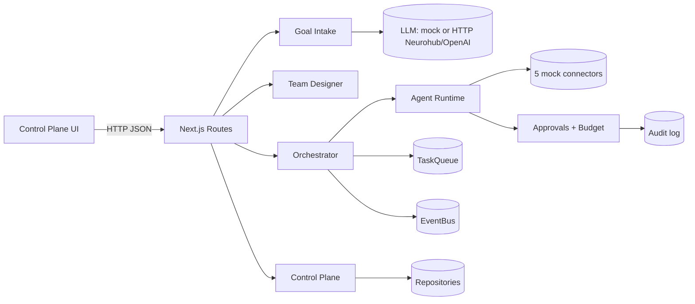

# Agent Company Factory — MVP

**Repository:** [github.com/Obrazcoff/agent-company-factory](https://github.com/Obrazcoff/agent-company-factory)

Architectural MVP that turns one goal prompt into a Company Blueprint, hires a team of role-based agents, runs them through an orchestrator with budget caps and human approvals, and exposes a transparent control plane.

> Built on Next.js 15 + TypeScript + Tailwind v4. In-memory infra; **blueprint** can use a **real OpenAI-compatible LLM** (OpenAI / Neurohub via env); **task runtime** still uses **mock connectors** (no real Gmail/CRM). See [`docs/CURRENT-BEHAVIOR.md`](./docs/CURRENT-BEHAVIOR.md) (EN + RU). Designed for a clean V1 swap to Postgres + Temporal + real connectors.

## TL;DR

```bash
npm install
npm run dev          # http://localhost:3000
# or:
npm run eval:agent   # CLI demo, 8/8 acceptance criteria PASS
npm test             # unit + integration + e2e (see CI)
```

## What it does

1. You give it a goal: _"Launch a B2B lead-gen company. Daily $50. All outbound emails require approval."_
2. Goal Intake → **Blueprint** (HTTP LLM when `LLM_PROVIDER` is `openai` / `neurohub`, else mock): mission, KPIs, budget, agents, initial tasks.
3. Team Designer hires PM / Researcher / Outreach / Ops with the right connector permissions.
4. Orchestrator ticks: picks ready tasks, dispatches to agent runtime, enforces budget + approvals.
5. Control Plane UI shows the team, queue, approvals, audit timeline, and per-agent cost in real-time (2s SWR poll).

## Acceptance criteria coverage

All 6 AC from the brief are tested and demoable. See [`docs/README.md`](./docs/README.md) for the mapping.

| AC                                                    | Where                                                            |
| ----------------------------------------------------- | ---------------------------------------------------------------- |
| AC-1 Blueprint from prompt                            | `src/factory/modules/goalIntake.ts`                              |
| AC-2 Data model (9 entities)                          | `src/factory/domain/types.ts`                                    |
| AC-3 Execution loop                                   | `src/factory/modules/orchestrator.ts`                            |
| AC-4 Safety rails (approvals + budget + pause/cancel) | `src/factory/policy/*`                                           |
| AC-5 Observability (audit + traces + cost)            | `src/factory/audit/audit.ts` + `Run.toolCalls`                   |
| AC-6 E2E demo                                         | `scripts/eval-agent.ts` + `tests/e2e/demo-scenario.test.ts` + UI |

## Docs

- [`docs/CURRENT-BEHAVIOR.md`](./docs/CURRENT-BEHAVIOR.md) — **EN + RU**: real LLM for blueprint vs mock task connectors
- [`docs/README.md`](./docs/README.md) — index
- [`docs/architecture/`](./docs/architecture/) — diagrams, data model, API contracts, state machines
- [`docs/decisions/`](./docs/decisions/) — ADR-001..005
- [`docs/runbooks/demo.md`](./docs/runbooks/demo.md) — 5-minute demo script
- [`docs/risks/`](./docs/risks/) — risks, trade-offs, threat model
- [`docs/bugs/`](./docs/bugs/) — bug log
- [`docs/learnings/`](./docs/learnings/) — post-session notes

## Architecture at a glance



## Scripts

| Command                                       | What                   |
| --------------------------------------------- | ---------------------- |
| `npm run dev`                                 | Next.js dev server     |
| `npm run build`                               | Production build       |
| `npm run check`                               | `tsc --noEmit` strict  |
| `npm test`                                    | All tests              |
| `npm run test:unit` / `:integration` / `:e2e` | Subset                 |
| `npm run verify`                              | check + test (CI gate) |
| `npm run eval:agent`                          | CLI demo (8/8 AC)      |

## Environment

```bash
cp .env.example .env.local   # mock LLM by default; set neurohub/openai for real blueprint
```

| Var                                      | Default | Note                                      |
| ---------------------------------------- | ------- | ----------------------------------------- |
| `LLM_PROVIDER`                           | `mock`  | `openai` or `neurohub` for real blueprint |
| `OPENAI_API_KEY` / base URL              | —       | for `openai`                              |
| `NEUROHUB_API_KEY` / `NEUROHUB_BASE_URL` | —       | for `neurohub` (OpenAI-compatible)        |
| `FACTORY_SEED`                           | `42`    | deterministic ids/mock                    |

## V1 swap (not in MVP)

| Interface       | Today                          | V1                                      |
| --------------- | ------------------------------ | --------------------------------------- |
| `Repository<T>` | in-memory                      | Postgres + Drizzle                      |
| `TaskQueue`     | in-memory + CAS                | Postgres `SKIP LOCKED` or Redis Streams |
| `EventBus`      | in-memory                      | Redis pub/sub or NATS                   |
| `tick()`        | manual button + tests          | Temporal worker + cron sweepers         |
| Mock connectors | synthetic data                 | OAuth-backed adapters                   |
| Blueprint LLM   | mock or HTTP OpenAI-compatible | Same + hosted gateways (Neurohub, etc.) |

See [`docs/decisions/ADR-001-tech-stack.md`](./docs/decisions/ADR-001-tech-stack.md) for rationale.
