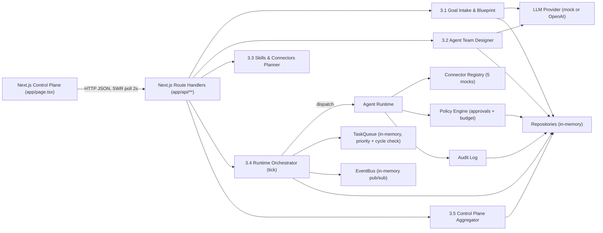

# Component diagram

## Module boundaries

| Module               | Owns                                   | Reads                   | Writes                                           |
| -------------------- | -------------------------------------- | ----------------------- | ------------------------------------------------ |
| Goal Intake (3.1)    | Blueprint generation, Company creation | LLM                     | companies, agents, tasks (initial), audits       |
| Team Designer (3.2)  | Agent role allocation                  | blueprint               | agents, audits                                   |
| Skills Planner (3.3) | Permission allocation                  | connector registry      | agents                                           |
| Orchestrator (3.4)   | tick loop, sweepers, lease, retries    | tasks, runs, approvals  | tasks, runs, audits, agents (status)             |
| Agent Runtime        | Single Run execution                   | task, agent, connectors | runs (trace, toolCalls, cost), audits, approvals |
| Control Plane (3.5)  | Aggregated read API                    | all repositories        | nothing                                          |
| Policy Engine        | Budget + approvals                     | companies, approvals    | companies (budget), approvals                    |
| Connectors           | External I/O (mocked)                  | input                   | nothing in MVP                                   |

## Where to swap for V1

| MVP component               | V1 target                                         |
| --------------------------- | ------------------------------------------------- |
| `Repository<T>` (in-memory) | Postgres + Drizzle/Prisma + outbox pattern        |
| `TaskQueue`                 | Redis Streams or NATS JetStream                   |
| `EventBus`                  | Same Redis/NATS topic                             |
| `tick()` polling            | Temporal worker + scheduled cron                  |
| Mock connectors             | Real OAuth-backed adapters; secrets via Vault     |
| Mock LLM                    | OpenAI/Anthropic via env, with structured outputs |
| `secretsRef` strings        | Vault/SOPS resolver                               |
