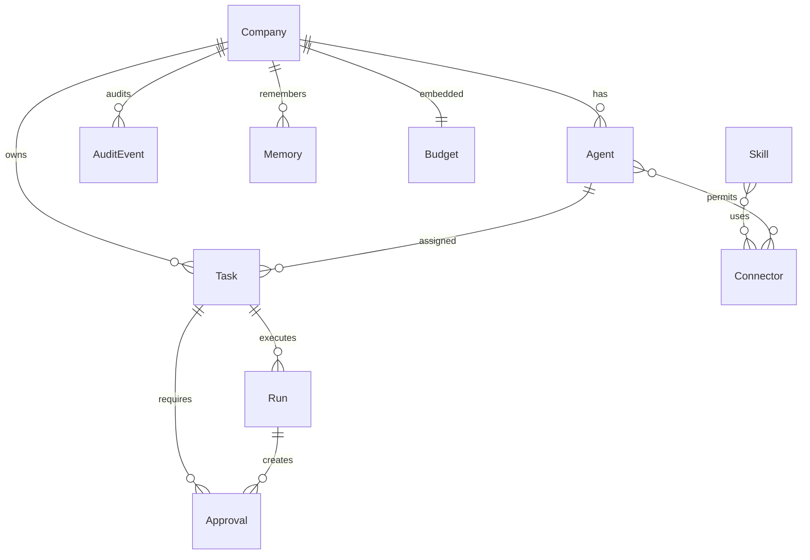

# Data model

All entities defined in [`src/factory/domain/types.ts`](../../src/factory/domain/types.ts). All entities carry `tenantId` (default `'default'`) for future multi-tenant isolation.

## ER diagram

## Entities

### Company

- `id, tenantId, missionPrompt, mission, kpis: KPI[], budget: Budget, status, createdAt`
- Statuses: `active | paused | archived`

### Agent

- `id, companyId, role: 'CEO'|'PM'|'Researcher'|'Outreach'|'Ops', name, systemPrompt, permissions: ConnectorId[], escalationRules, status, costToDateUsd`
- Statuses: `idle | busy | paused`

### Task (full FSM in [state-machines.md](./state-machines.md))

- `id, companyId, agentId, kind, input, status, dependsOn: TaskId[], idempotencyKey, scheduledAt, attempts, maxAttempts, lockedBy?, lockedUntil?, parentRunId?, depth, runTimeoutMs, estCostUsd, lastError?, createdAt, updatedAt`
- Statuses: `queued | running | awaiting_approval | done | failed | cancelled`

### Run

- `id, taskId, agentId, companyId, startedAt, heartbeatAt, finishedAt?, status, attempts, traceEvents[], toolCalls[], llmCallCount, toolCallCount, costUsd, output?, error?, depth`
- Statuses: `running | done | failed | timed_out`

### Approval (first-class entity, not just a flag)

- `id, taskId, runId, companyId, requestedBy, action: { connectorId, payload, description }, status, requestedAt, deadlineAt, decidedAt?, decidedBy?, reason?`
- Statuses: `pending | approved | rejected | expired`

### Skill / Connector (Connectors are static metadata + executable code)

- `Skill: id, name, description, requiredConnectors`
- `ConnectorMeta: id, name, kind, requiresApproval, scopes, secretsRef`

### Budget

- `dailyCapUsd, hardCapUsd, spentTodayUsd, lastResetAt`
- Daily reset on first `canSpend()` call after a new UTC day.

### AuditEvent

- `id, companyId, ts, actor: 'system'|'agent'|'human', actorId?, kind, payload`
- 23 distinct kinds (see [`src/factory/events/types.ts`](../../src/factory/events/types.ts)).

### Memory (V1: plain text; V2: vector)

- `id, companyId, agentId?, kind: 'fact'|'note'|'artifact', content, refs[], createdAt`
