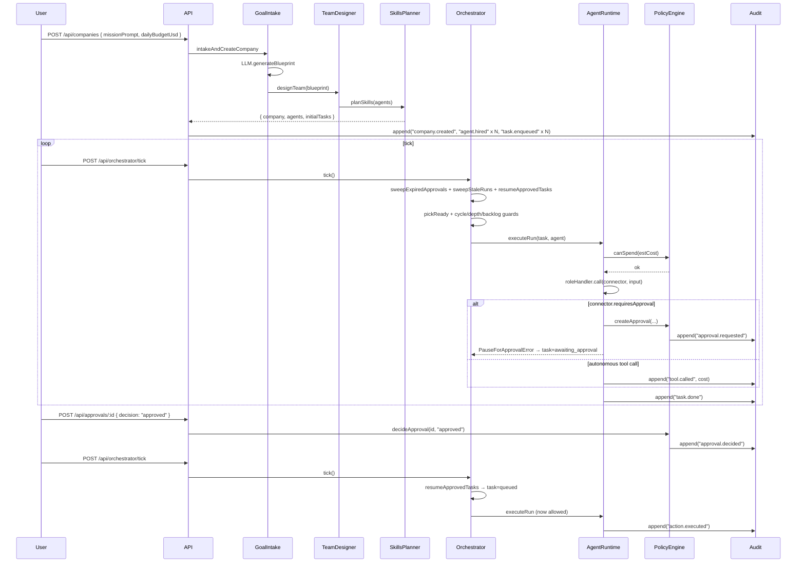

# Sequence diagram

## Happy path with one approval gate

## Failure paths covered by tests

| Path                             | Test    | Outcome                                                  |
| -------------------------------- | ------- | -------------------------------------------------------- |
| handler throws 3×                | case 1  | task=failed, audit `task.dead_letter`                    |
| approval past deadline           | case 2  | approval=expired, task=failed                            |
| handler hangs (no heartbeat 60s) | case 3  | run=failed, task re-queued, audit `run.stale_recovered`  |
| two ticks claim same task        | case 4  | exactly one Run created                                  |
| cyclic deps at enqueue           | case 5  | `400 cyclic_dependency`, audit `task.rejected_cyclic`    |
| follow-up at depth > 5           | case 6  | rejected, audit `task.rejected_max_depth`                |
| handler runs > runTimeoutMs      | case 7  | run=timed_out, task retried                              |
| 50 slow tasks in tick            | case 8  | tick yields after 5s, deferred remaining                 |
| >20 tool calls in one Run        | case 9  | run=failed, audit `run.call_cap_exceeded`                |
| approve+reject same approval     | case 10 | second decision returns 409                              |
| budget hard cap reached          | case 11 | company=paused, queued cancelled, audit `company.killed` |
| parent task fails                | case 12 | dependents cascade-cancelled                             |
