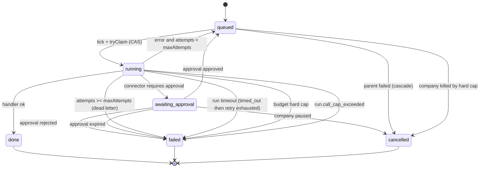
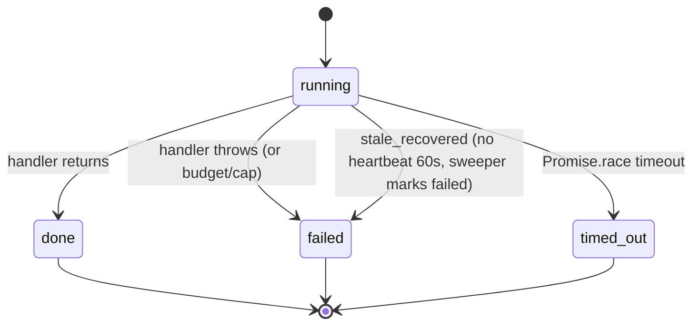
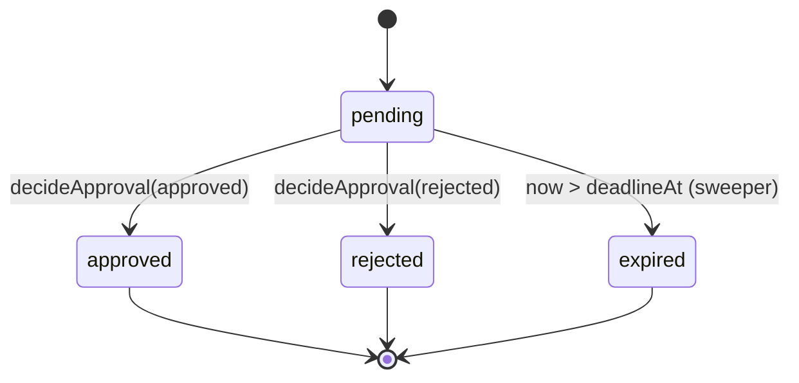
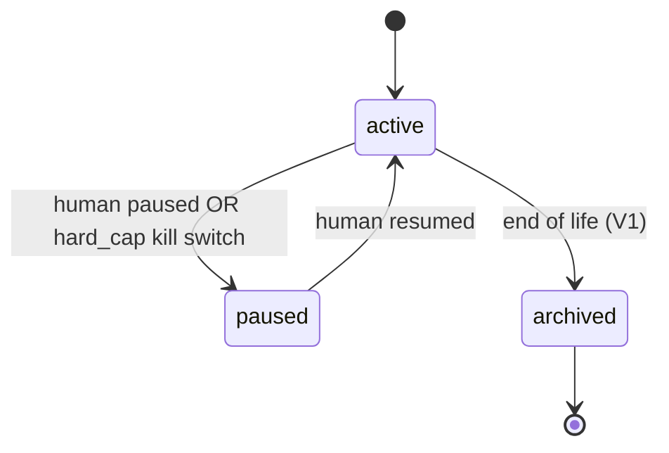
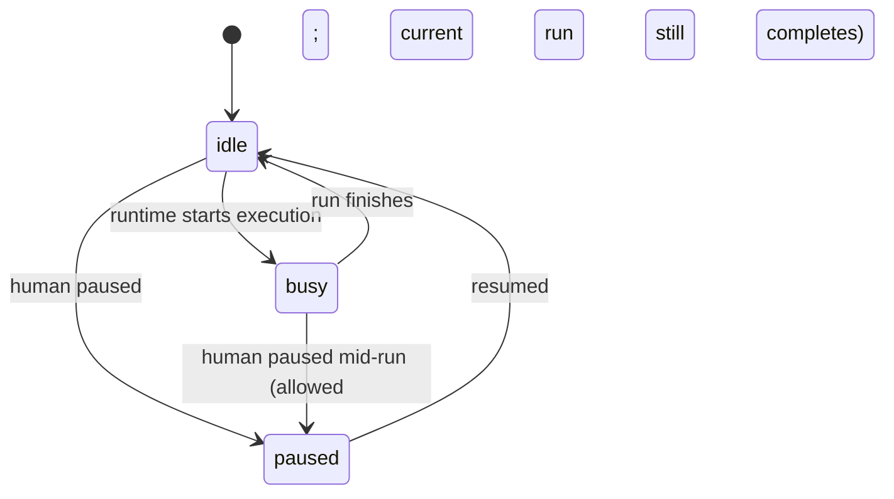

# State machines

## Task

```mermaid
stateDiagram-v2
  [*] --> queued
  queued --> running: tick + tryClaim (CAS)
  running --> done: handler ok
  running --> awaiting_approval: connector requires approval
  awaiting_approval --> queued: approval approved
  awaiting_approval --> failed: approval rejected
  awaiting_approval --> failed: approval expired
  awaiting_approval --> cancelled: company paused
  running --> queued: error and attempts < maxAttempts
  running --> failed: attempts >= maxAttempts (dead letter)
  running --> failed: run timeout (timed_out then retry exhausted)
  running --> failed: budget hard cap
  running --> failed: run.call_cap_exceeded
  queued --> cancelled: parent failed (cascade)
  queued --> cancelled: company killed by hard cap
  done --> [*]
  failed --> [*]
  cancelled --> [*]
```

## Run

```mermaid
stateDiagram-v2
  [*] --> running
  running --> done: handler returns
  running --> failed: handler throws (or budget/cap)
  running --> timed_out: Promise.race timeout
  running --> failed: stale_recovered (no heartbeat 60s, sweeper marks failed)
  done --> [*]
  failed --> [*]
  timed_out --> [*]
```

## Approval

```mermaid
stateDiagram-v2
  [*] --> pending
  pending --> approved: decideApproval(approved)
  pending --> rejected: decideApproval(rejected)
  pending --> expired: now > deadlineAt (sweeper)
  approved --> [*]
  rejected --> [*]
  expired --> [*]
```

## Company

```mermaid
stateDiagram-v2
  [*] --> active
  active --> paused: human paused OR hard_cap kill switch
  paused --> active: human resumed
  active --> archived: end of life (V1)
  archived --> [*]
```

## Agent

```mermaid
stateDiagram-v2
  [*] --> idle
  idle --> busy: runtime starts execution
  busy --> idle: run finishes
  idle --> paused: human paused
  busy --> paused: human paused mid-run (allowed; current run still completes)
  paused --> idle: resumed
```
